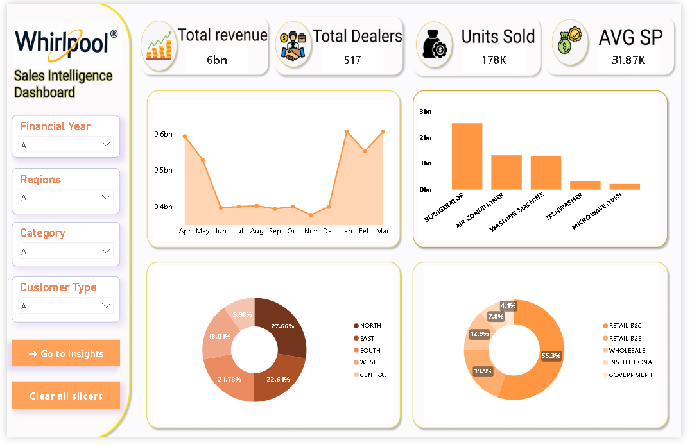
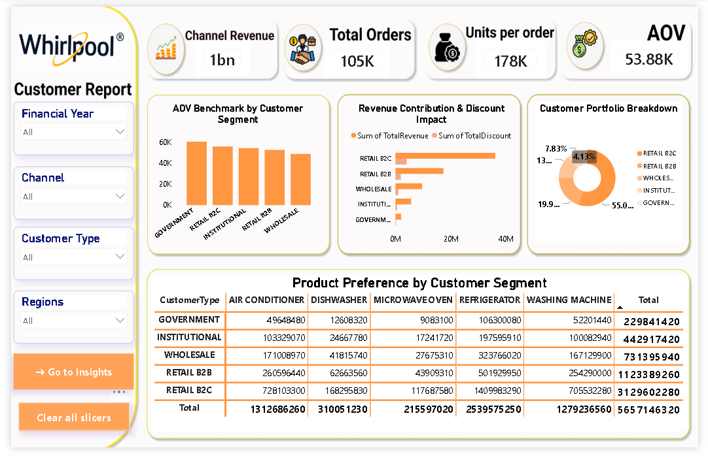
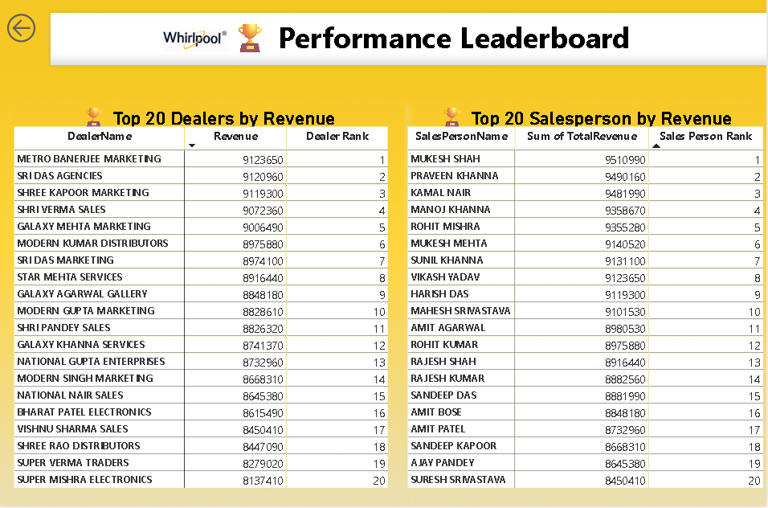
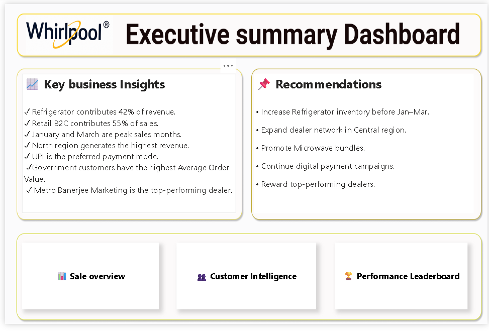

# 📊 Whirlpool Sales Intelligence Platform

### Enterprise Business Intelligence Solution | Power BI | DAX | Power Query

An end-to-end **Business Intelligence solution** developed in **Power BI** to analyze Whirlpool's sales performance across products, customers, dealers, and regions.

The dashboard transforms raw transactional data into executive-ready insights through interactive visualizations, KPI tracking, and performance analytics, enabling data-driven decision-making for business stakeholders.

---

# 🚀 Project Overview

The Whirlpool Sales Intelligence Platform was designed to centralize business reporting into a single interactive solution. Instead of relying on static reports, decision-makers can explore revenue trends, customer behavior, dealer performance, and strategic recommendations through dynamic dashboards.

This project demonstrates how Business Intelligence can simplify complex sales data and convert it into meaningful business insights.

---

# 🎯 Business Objectives

- Monitor overall sales performance
- Analyze monthly revenue trends
- Evaluate customer purchasing behavior
- Track dealer and salesperson performance
- Measure product category contribution
- Identify growth opportunities across regions
- Support executive-level decision making

---

# 🛠 Technology Stack

| Technology | Purpose |
|------------|---------|
| Power BI | Dashboard Development |
| Power Query | Data Cleaning & Transformation |
| DAX | Business Calculations & KPIs |
| Data Modeling | Relationship Management |
| Excel | Source Dataset |

---

# 📊 Business KPIs

The dashboard tracks key business metrics including:

- 💰 **Total Revenue:** ₹6 Billion
- 👥 **Active Dealers:** 517
- 📦 **Units Sold:** 178K
- 🛒 **Total Orders:** 105K
- 💵 **Average Selling Price (ASP):** ₹31.87K
- 💳 **Average Order Value (AOV):** ₹53.88K

---

# 📊 Dashboard Walkthrough

---

# 🏠 Page 1 – Sales Intelligence Dashboard

The Sales Intelligence Dashboard provides a comprehensive overview of Whirlpool's overall business performance. It enables stakeholders to monitor key KPIs, identify revenue trends, and analyze sales distribution across products, customers, and regions.

### Dashboard Highlights

- ₹6 Billion Total Revenue
- 517 Active Dealers
- 178K Units Sold
- ₹31.87K Average Selling Price
- Monthly Revenue Trend
- Product Category Analysis
- Regional Revenue Distribution
- Customer Type Breakdown
- Interactive Slicers for Dynamic Analysis

### Dashboard Preview

---

# 👥 Page 2 – Customer Intelligence Dashboard

The Customer Intelligence Dashboard focuses on understanding purchasing behavior across customer segments. It provides insights into revenue contribution, product preferences, discount impact, and customer value.

### Dashboard Highlights

- ₹1 Billion Channel Revenue
- 105K Orders
- 178K Units Sold
- ₹53.88K Average Order Value
- Customer Portfolio Distribution
- Segment-wise Revenue Contribution
- Discount Impact Analysis
- Product Preference Matrix
- AOV Benchmark by Customer Segment

### Dashboard Preview

---

# 🏆 Page 3 – Performance Leaderboard

The Performance Leaderboard identifies top-performing dealers and salespersons using dynamic ranking techniques. This dashboard helps management recognize high performers and monitor sales effectiveness.

### Dashboard Highlights

- Top 20 Dealers by Revenue
- Top 20 Salespersons by Revenue
- Dealer Ranking
- Salesperson Ranking
- Revenue Performance Comparison
- Interactive Performance Analysis

### Dashboard Preview

---

# 📋 Page 4 – Executive Summary Dashboard

The Executive Summary Dashboard consolidates the most important business findings into a single page, providing leadership teams with strategic insights and actionable recommendations.

### Key Business Insights

- Refrigerator contributes **42%** of total revenue.
- Retail B2C contributes **55%** of total sales.
- January and March are the highest revenue-generating months.
- North region generates the highest overall revenue.
- Government customers have the highest Average Order Value.
- Metro Banerjee Marketing ranks as the top-performing dealer.

### Strategic Recommendations

- Increase refrigerator inventory before peak demand (January–March).
- Expand the dealer network in the Central region.
- Promote Microwave Oven bundle offers to improve sales.
- Continue digital payment campaigns.
- Reward top-performing dealers and salespersons through incentive programs.

### Dashboard Preview

---

# 📈 Key Business Insights

## Sales Performance

- Generated over **₹6 Billion** in total revenue.
- Successfully sold **178K+ units** across multiple product categories.
- Managed sales through **517 active dealers**.

## Product Insights

- Refrigerator is the highest revenue-generating product category.
- Microwave Oven contributes the lowest revenue share.
- Product demand varies significantly across customer segments.

## Customer Insights

- Retail B2C contributes **55%** of total revenue.
- Government customers generate the highest Average Order Value.
- Wholesale customers remain significant contributors to business revenue.

## Regional Insights

- North region leads overall sales performance.
- Central region presents growth opportunities.
- Revenue distribution highlights market potential across regions.

## Performance Insights

- Ranked Top 20 Dealers based on revenue generation.
- Ranked Top 20 Salespersons using dynamic DAX calculations.
- Built interactive leaderboards for performance evaluation.

---

# 💼 Business Impact

This dashboard enables stakeholders to:

- Monitor organizational performance through real-time KPIs.
- Evaluate dealer and salesperson efficiency.
- Understand customer purchasing behavior.
- Identify high-performing products and customer segments.
- Support strategic planning using data-driven insights.
- Reduce reporting time through centralized Business Intelligence.

---

# 💡 Skills Demonstrated

### Business Intelligence

- Executive Dashboard Design
- KPI Development
- Business Storytelling
- Interactive Reporting

### Power BI

- Data Modeling
- Bookmarks & Navigation
- Interactive Slicers
- Matrix Visualizations
- Conditional Formatting
- Custom UI Design

### DAX

- Measures
- Calculated Columns
- Dynamic Ranking
- Time Intelligence
- KPI Calculations

### Power Query

- Data Cleaning
- Data Transformation
- Data Preparation
- Feature Engineering

---

# 👨‍💻 About Me

**Uma Rai**

Aspiring **Data Analyst** passionate about transforming raw data into meaningful business insights using **SQL, Excel, Power BI, Python, and Business Intelligence**.

Currently building end-to-end analytics projects focused on solving real-world business problems through data.

### Connect With Me

- **GitHub:** https://github.com/raiuma1116-blip
- **LinkedIn:** *https://www.linkedin.com/in/umarai12/*

---

# ⭐ Support

If you found this project useful or interesting:

⭐ Star this repository
